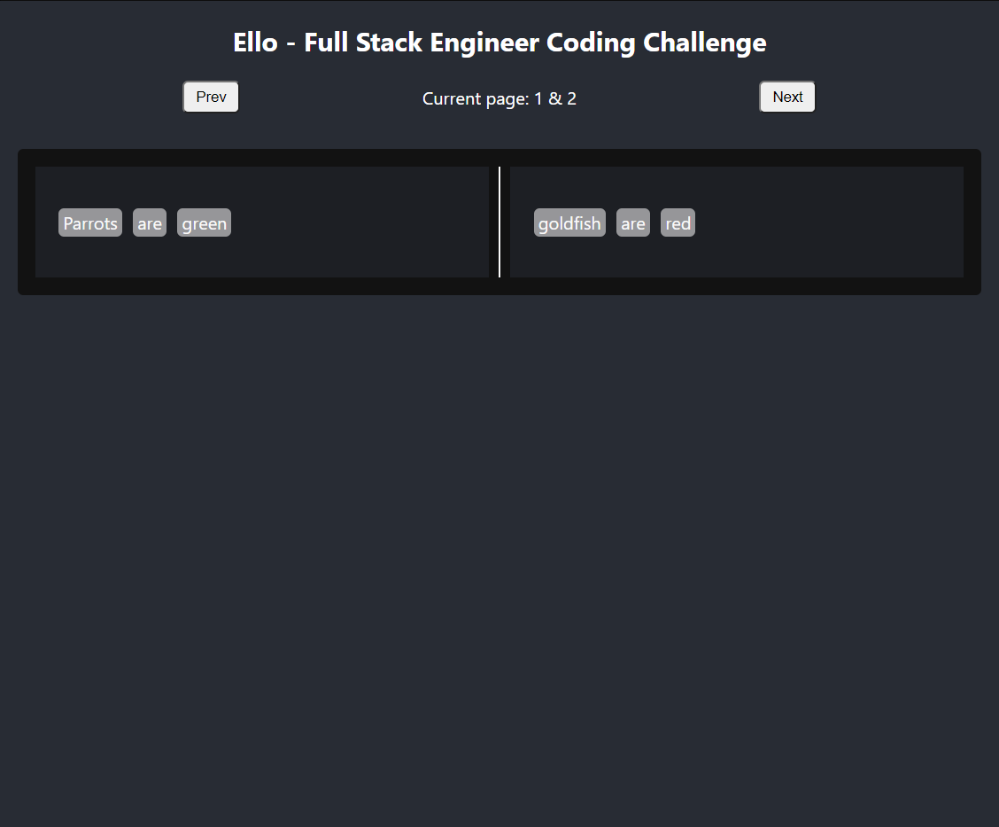
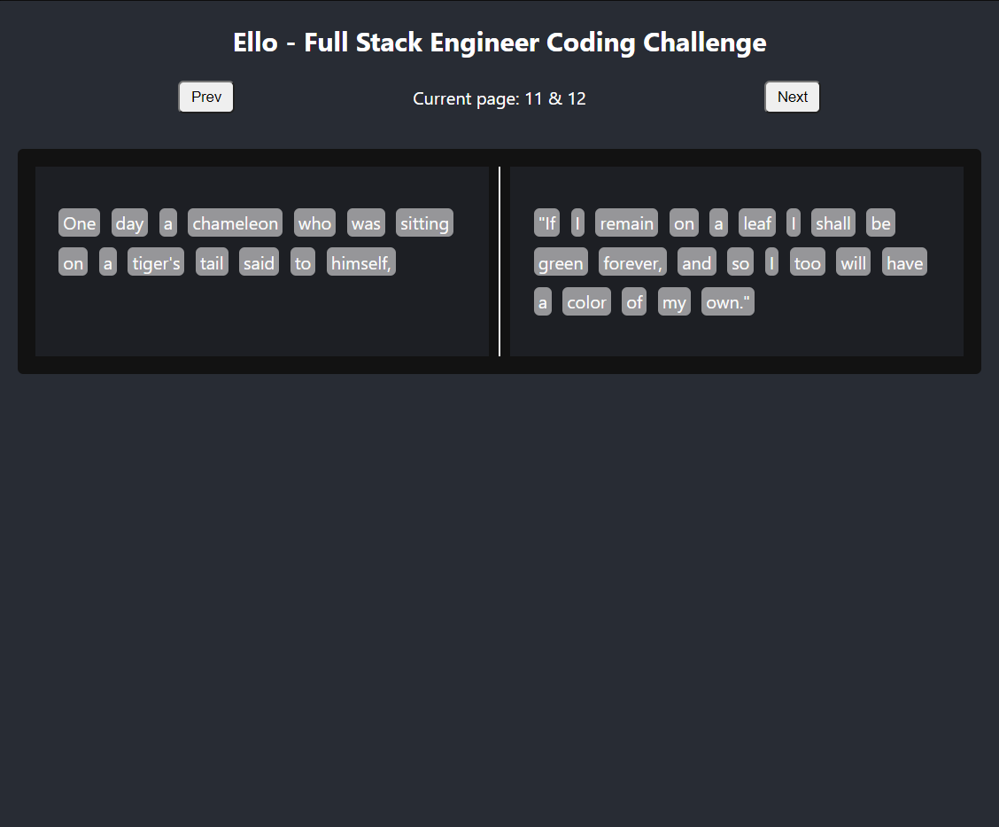

# Ello - Full Stack Engineer Coding Challenge

    Originally bootstrapped using `npx create-react-app`

Link to the challenge: [👉 Here](https://github.com/ElloTechnology/full-stack-test)

## Screenshots

|       Screenshot 1        |
|:-------------------------:|
|  |

|       Screenshot 2        |
|:-------------------------:|
|  |

|       Screenshot 3        |
|:-------------------------:|
|  |

|       Screenshot 4        |
|:-------------------------:|
|  |

`By MURAGE (April 2022).`