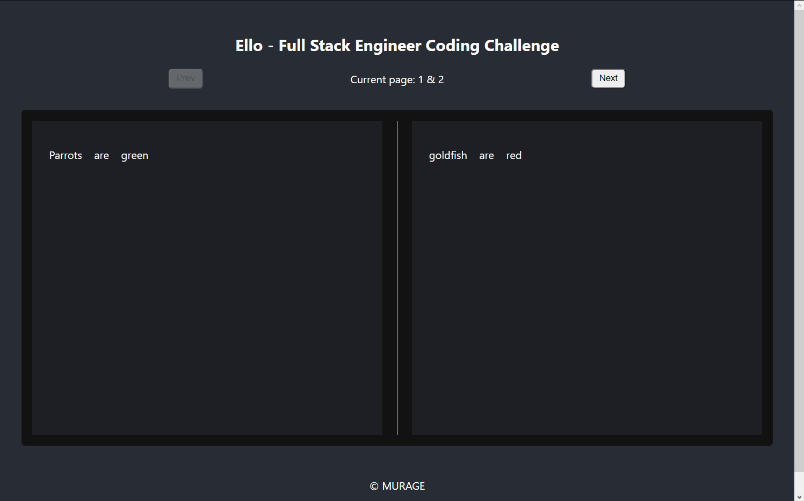
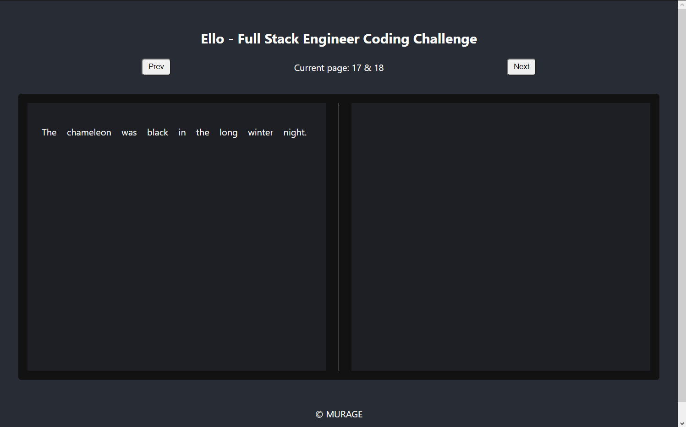

# Ello - Full Stack Engineer Coding Challenge

### Click here to [Preview live site](https://ello-test.netlify.app)

    Originally bootstrapped using `npx create-react-app`

Link to the challenge: [👉 Here](https://github.com/ElloTechnology/full-stack-test)

## Screenshots

|        First page         |
|:-------------------------:|
|  |

|         Modal view         |
|:--------------------------:|
|  |

|       An empty page       |
|:-------------------------:|
|  |

|         Last page         |
|:-------------------------:|
|  |

`By MURAGE (April 2022).`